<div align="center">


<a href="#">
  
</a>

<br/><br/>
<a href="https://educlasses.netlify.app/">
  
</a>

<br/><br/>

[](https://educlasses.netlify.app/)

[](https://github.com/monika0712/educlasses/commits/main)
[](https://github.com/monika0712/educlasses)
[](https://github.com/monika0712/educlasses/stargazers)
[](#-contact)

<br/>


</div>

<br/>


<div align="center">

### 📊 At a Glance

<table width="100%">
<tr>
<td align="center" width="16%">
📚 <b>Courses</b><br/>
<h3>9</h3>
</td>

<td align="center" width="16%">
🖥️ <b>Frontend Pages</b><br/>
<h3>8</h3>
</td>

<td align="center" width="16%">
📡 <b>API Endpoints</b><br/>
<h3>12</h3>
</td>

<td align="center" width="16%">
🗄️ <b>Collections</b><br/>
<h3>4</h3>
</td>

<td align="center" width="16%">
⚙️ <b>Auth</b><br/>
<i>JWT + bcrypt</i>
</td>

<td align="center" width="16%">
🚀 <b>Live Demo</b><br/>
<a href="https://educlasses.netlify.app/">View App</a>
</td>
</tr>

<tr>


</table>

</div>

## 📖 Table of Contents

**🧭 Getting to know it**

&nbsp;&nbsp;📌 [Overview](#-overview) &nbsp;·&nbsp; 📸 [Screenshots](#-screenshots) &nbsp;·&nbsp; ✨ [Features](#-features) &nbsp;·&nbsp; 🔄 [How It Works](#-how-it-works)

**🛠️ Building it**

&nbsp;&nbsp;🧰 [Tech Stack](#-tech-stack) &nbsp;·&nbsp; 📁 [Project Structure](#-project-structure) &nbsp;·&nbsp; 🚀 [Getting Started](#-getting-started) &nbsp;·&nbsp; 📡 [API Reference](#-api-reference)

**🌍 Beyond the code**

&nbsp;&nbsp;🔍 [Checking Your Data](#-checking-your-data) &nbsp;·&nbsp; ☁️ [Deployment](#️-deployment) &nbsp;·&nbsp; 🛠 [Skills Demonstrated](#-skills-demonstrated) &nbsp;·&nbsp; 🗺️ [Roadmap](#️-roadmap) &nbsp;·&nbsp; 🤝 [Contributing](#-contributing) &nbsp;·&nbsp; 📬 [Contact](#-contact)

---

## 📌 Overview

> **EduClasses** is a full-stack training-institute platform — a public website for course discovery and enquiries, paired with a secure student portal and admin dashboard, all built on a real MongoDB-backed API.

Visitors can browse the course catalog, check the live batch schedule, and submit enquiries. Students get their own account with a personal dashboard, protected by JWT sessions and bcrypt-hashed passwords. Admins get a dedicated dashboard to manage every student, batch, and enquiry — all pulled live from the database, nothing hardcoded.

The frontend is built with **HTML, CSS, and JavaScript**; the backend is a **Node.js + Express + MongoDB** REST API, with authentication and role-based access (student vs. admin) handled end-to-end.

<div align="right">

[⬆ back to top](#-table-of-contents)

</div>

---

## 📸 Screenshots

### 🏠 Home Page <sub>(5)</sub>

<table width="100%">
<tr>
<td align="center" width="33%">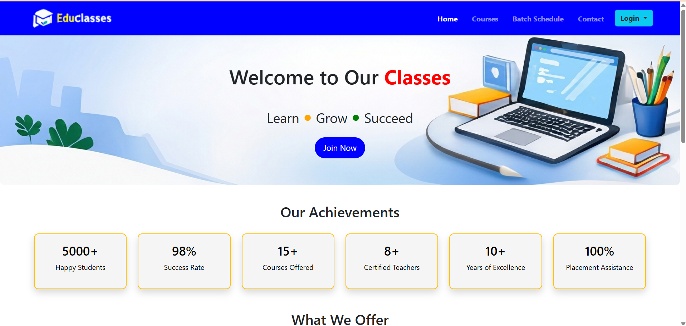<br/><sub><b>Hero</b> — banner & call-to-action</sub></td>
<td align="center" width="33%">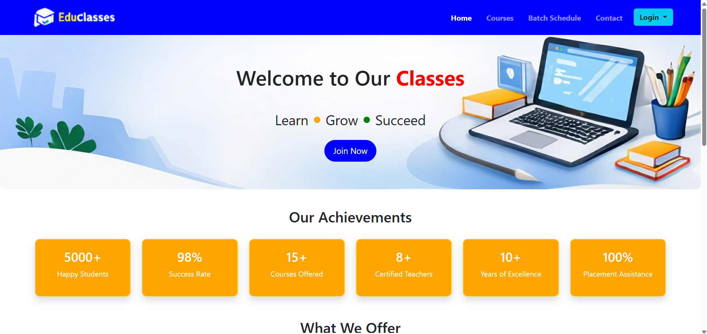<br/><sub><b>Our Achievements</b> — students, success rate, courses</sub></td>
<td align="center" width="33%">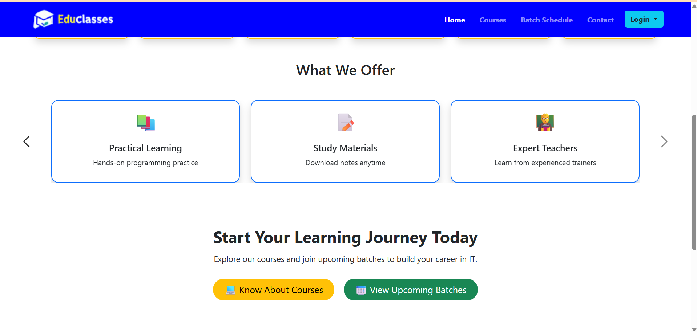<br/><sub><b>What We Offer</b></sub></td>
</tr>
<tr>
<td align="center" width="33%">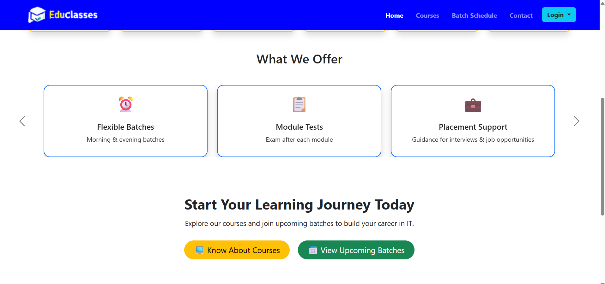<br/><sub><b>Start your Journey</b></sub></td>
<td align="center" width="33%">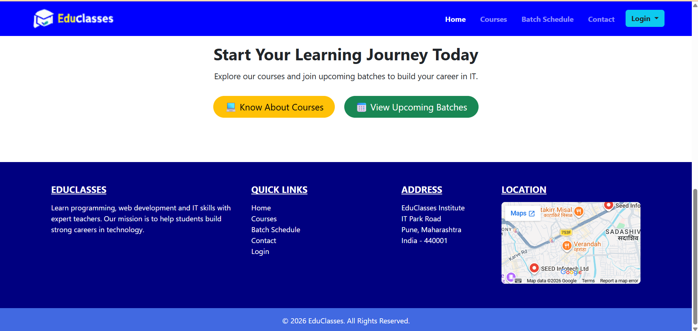<br/><sub><b>Footer</b></sub></td>
<td width="33%"></td>
</tr>
</table>

### 📚 Courses <sub>(5)</sub>

<table width="100%">
<tr>
<td align="center" width="33%"><br/><sub><b>Page Header</b></sub></td>
<td align="center" width="33%">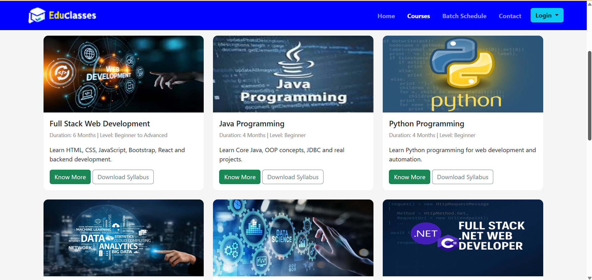<br/><sub><b>Full Stack / Java / Python</b></sub></td>
<td align="center" width="33%">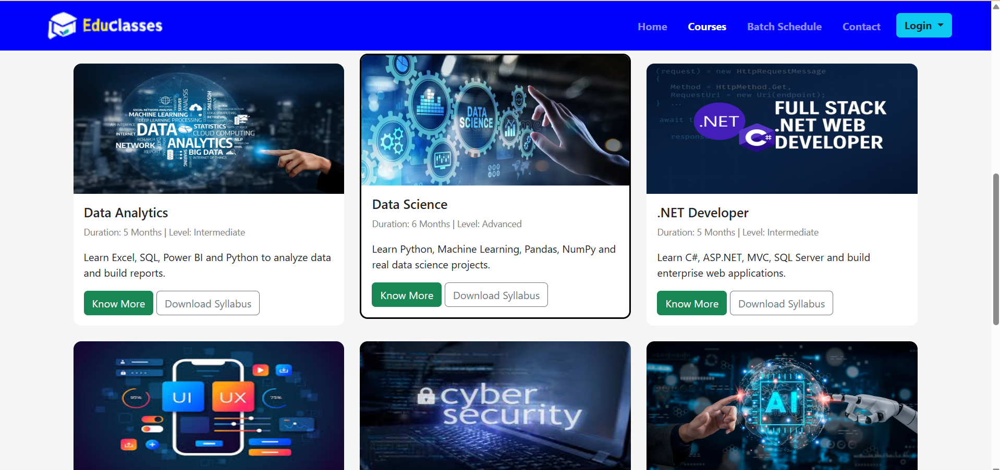<br/><sub><b>Data Analytics / Data Science / .NET</b></sub></td>
</tr>
<tr>
<td align="center" width="33%">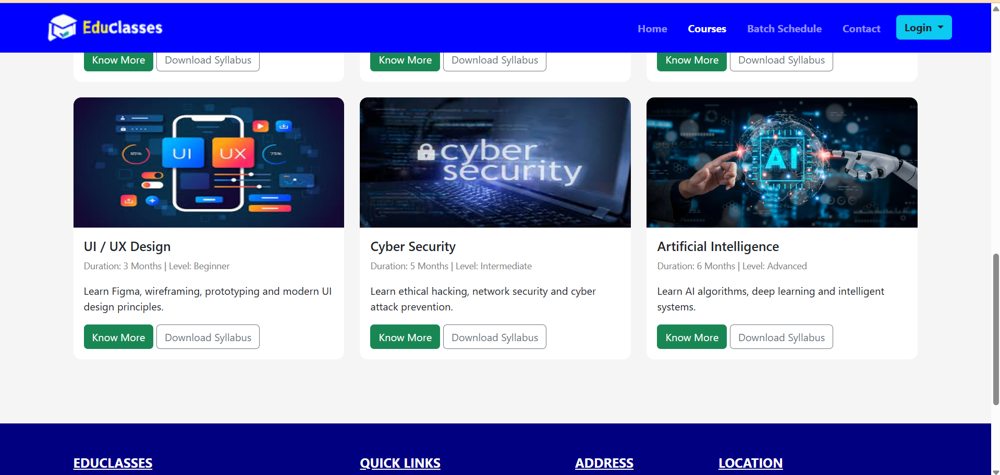<br/><sub><b>UI/UX / Cyber Security / AI</b></sub></td>
<td align="center" width="33%">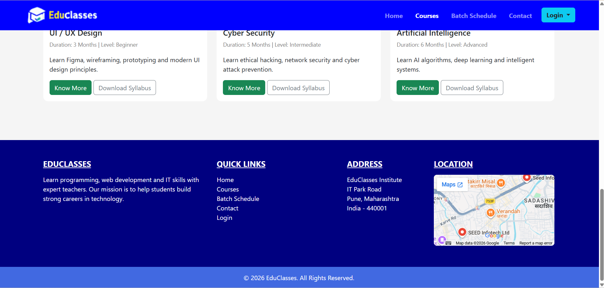<br/><sub><b>Footer</b></sub></td>
<td width="33%"></td>
</tr>
</table>

<p align="center"><i>All 9 courses — Web Development, Java, Python, Data Analytics, Data Science, .NET, UI/UX, Cybersecurity, AI — each with a <b>Know More</b> and <b>Download Syllabus</b> action.</i></p>

### 🗓️ Batch Schedule <sub>(3)</sub>

<table width="100%">
<tr>
<td align="center" width="33%">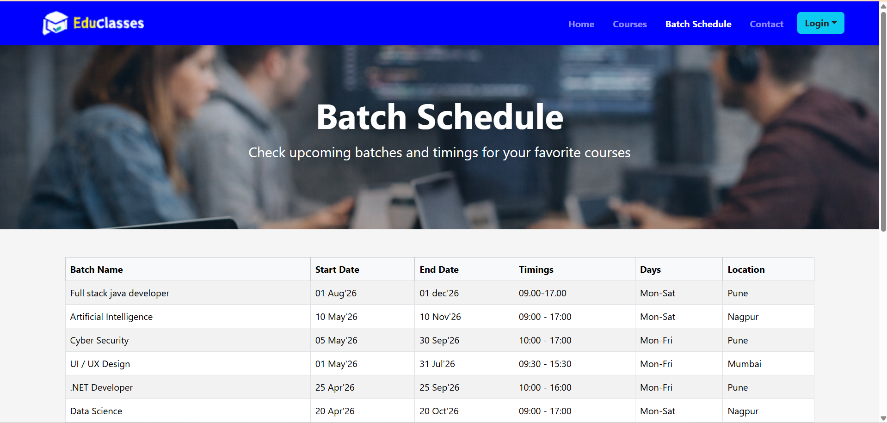<br/><sub><b>Batch Schedule</b></sub></td>
<td align="center" width="33%">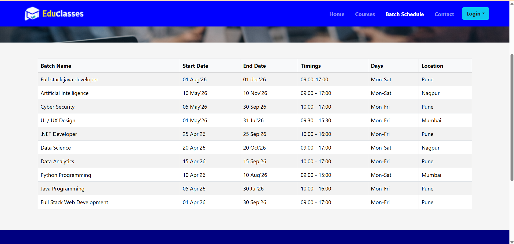<br/><sub><b>More Upcoming Batches</b></sub></td>
<td align="center" width="33%">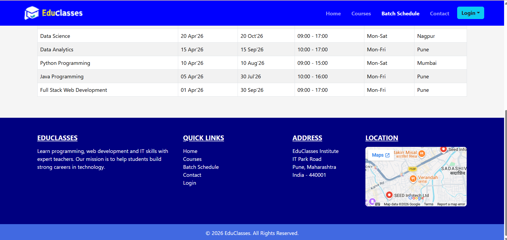<br/><sub><b>Footer</b></sub></td>
</tr>
</table>

<p align="center"><i>Live batch timings pulled from the <code>Batch</code> collection — no more static tables to edit by hand.</i></p>

### ✉️ Contact Us <sub>(3)</sub>

<table width="100%">
<tr>
<td align="center" width="33%">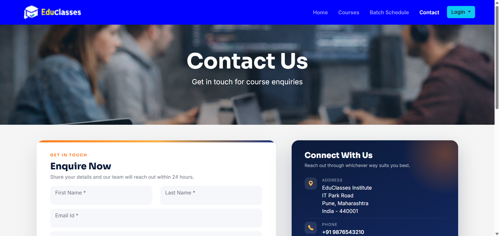<br/><sub><b>Contact Page</b></sub></td>
<td align="center" width="33%">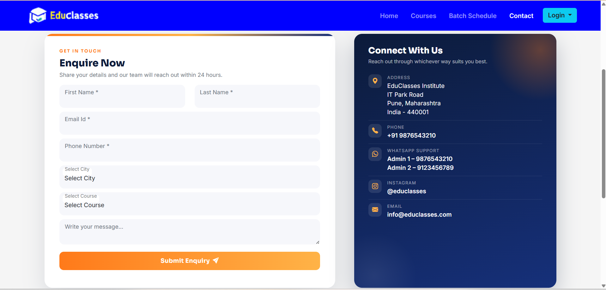<br/><sub><b>Contact Details and Enquiry Form</b></sub></td>
<td align="center" width="33%">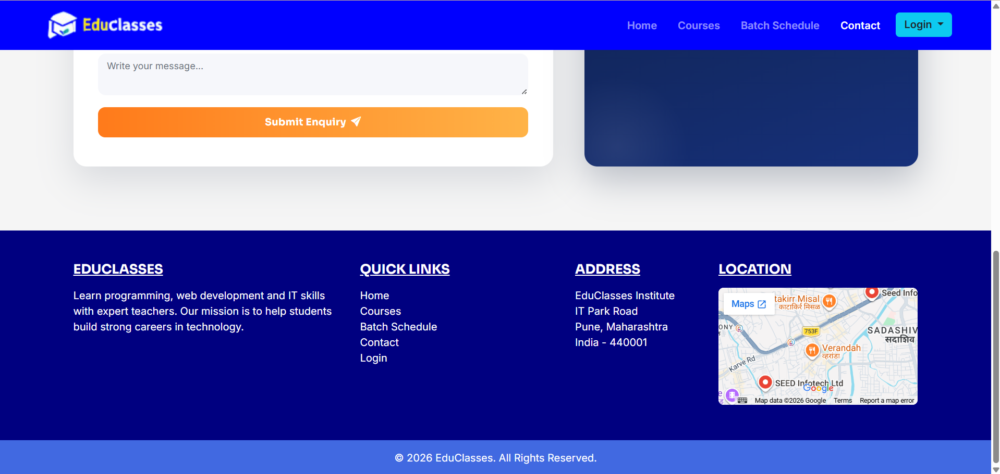<br/><sub>Footer</sub></td>
</tr>
</table>

<p align="center"><i>Submits straight to the backend and saves as a real <code>Enquiry</code> document in MongoDB — the team can act on it right away.</i></p>

### 🔐 Student & Admin Login <sub>(7)</sub>

<table width="100%">
<tr>
<td align="center" width="33%">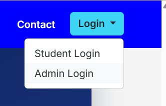<br/><sub><b>Login Dropdown</b> — Student / Admin</sub></td>
<td align="center" width="33%">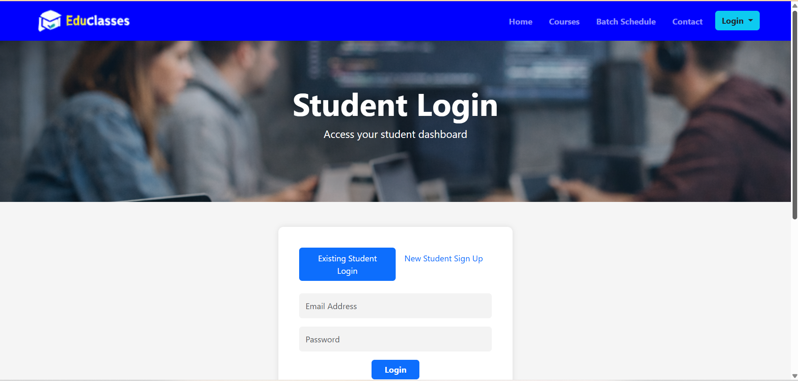<br/><sub><b>Student Login</b></sub></td>
<td align="center" width="33%">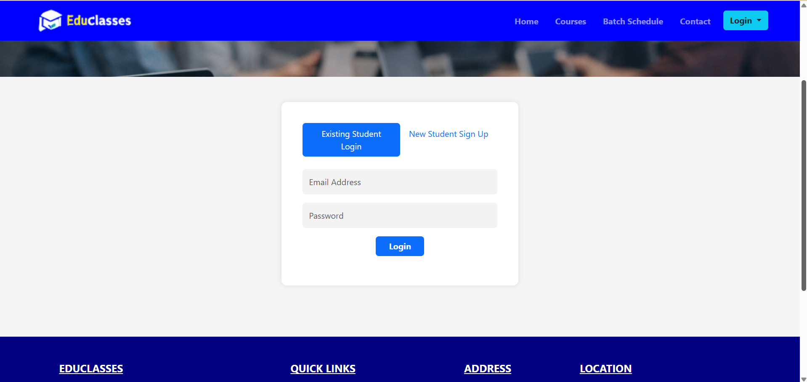<br/><sub><b>Student Sign In</b></sub></td>
</tr>
<tr>
<td align="center" width="33%">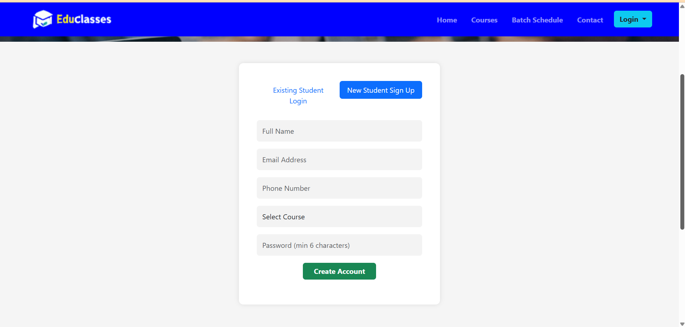<br/><sub><b>Sign Up</b> — form filled</sub></td>
<td align="center" width="33%">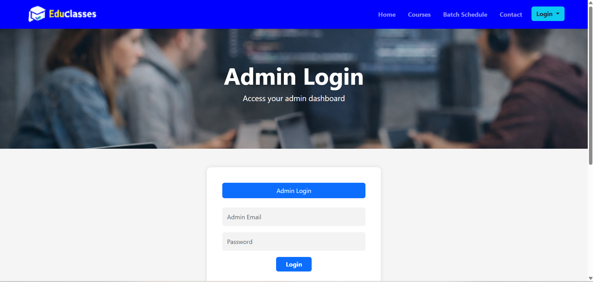<br/><sub><b>Admin Login</b> — access</sub></td>

<td align="center" width="33%">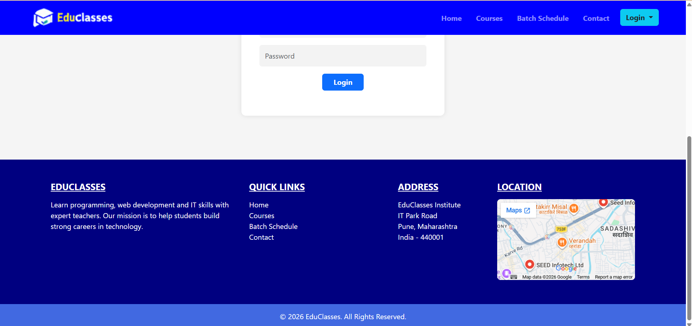<br/><sub><b>Footer</b> </sub></td>
<td width="33%"></td>
<td width="33%"></td>
</tr>
</table>

<p align="center"><i>The "Login" dropdown in the navbar splits into <b>Student Login</b> and <b>Admin Login</b> — both hit real endpoints, backed by bcrypt-hashed passwords and JWT sessions.</i></p>

### 👤 Student Dashboard <sub>(1)</sub>

<p align="center"></p>
<p align="center"><i>Profile pulled live from MongoDB right after sign-up — no page reload, no dummy data.</i></p>

### 🛡️ Admin Panel <sub>(4)</sub>

<table width="100%">
<tr>
<td align="center" width="50%">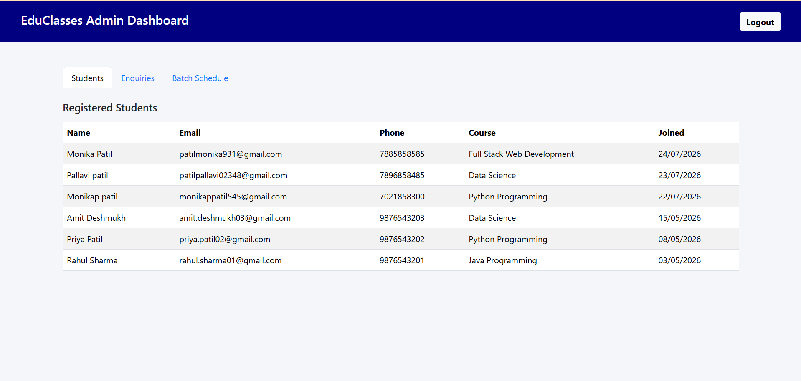<br/><sub><b>Manage Students</b> — every registered student, pulled live</sub></td>
<td align="center" width="50%">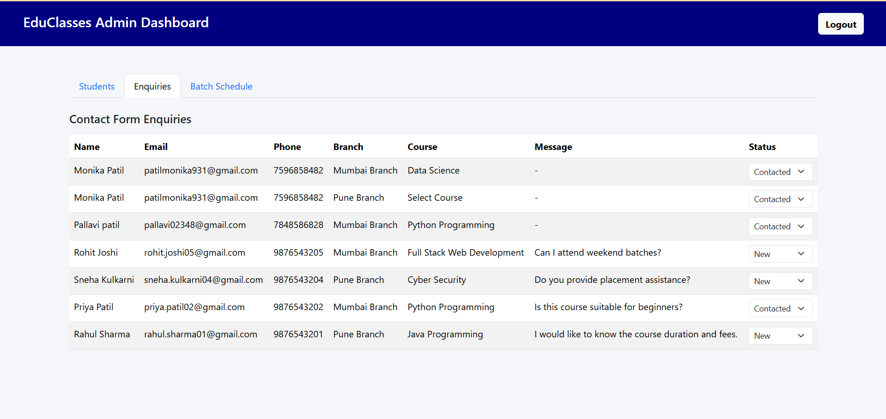<br/><sub><b>Manage Enquiries</b></sub></td>
</tr>
<tr>
<td align="center" width="50%">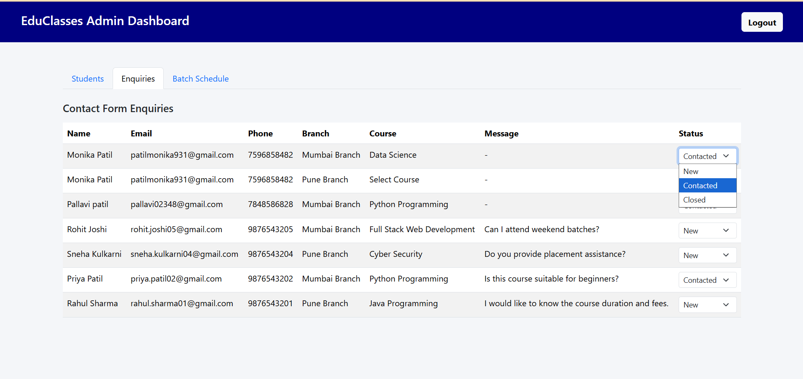<br/><sub><b>Manage Enquiries</b> — track status: new / contacted / closed</sub></td>
<td align="center" width="50%">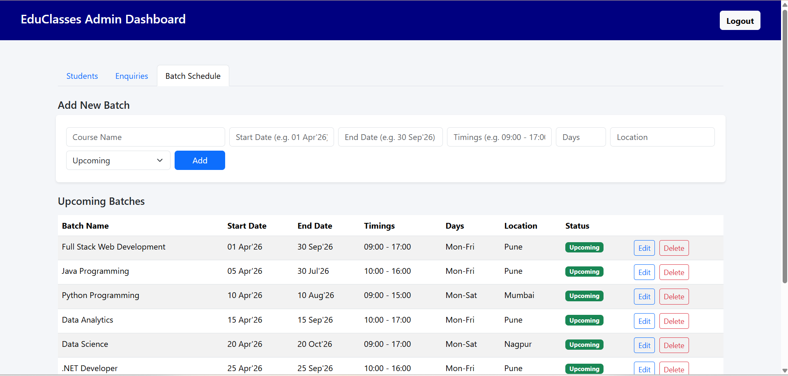<br/><sub><b>Manage Batches</b> — full list with edit / delete</sub></td>
</tr>
</table>

<div align="right">

[⬆ back to top](#-table-of-contents)

</div>

---

## ✨ Features

<table width="100%">
<tr><td>

#### 🔐 Authentication & Accounts 

</td></tr>
<tr><td>✅ &nbsp; <b>JWT-based</b> student register / login, sessions kept in <code>localStorage</code></td></tr>
<tr><td>✅ &nbsp; Passwords hashed with <b>bcrypt</b> for both students and admin — never stored in plain text</td></tr>
<tr><td>✅ &nbsp; Separate <b>Admin Login</b>, seeded from environment variables, not a public sign-up form</td></tr>

<tr><td>

#### 📚 Course Catalog & Batches 

</td></tr>
<tr><td>✅ &nbsp; <b>9 professional courses</b> — Web Dev, Java, Python, Data Analytics, Data Science, .NET, UI/UX, Cybersecurity, AI — each with a downloadable syllabus PDF</td></tr>
<tr><td>✅ &nbsp; <b>Batch Schedule</b> page reads live from the <code>Batch</code> collection, so schedule updates show up instantly</td></tr>

<tr><td>

#### ✉️ Contact / Enquiry System 

</td></tr>
<tr><td>✅ &nbsp; Contact form saves a real <code>Enquiry</code> document (name, email, phone, branch, course, message)</td></tr>
<tr><td>✅ &nbsp; Admin can track each enquiry's status: <code>new</code> → <code>contacted</code> → <code>closed</code></td></tr>

<tr><td>

#### 🛡️ Admin Dashboard 

</td></tr>
<tr><td>✅ &nbsp; <b>Manage Students</b> — view every registered account (passwords excluded from the response)</td></tr>
<tr><td>✅ &nbsp; <b>Manage Batches</b> — full CRUD: add, update, delete batch schedules</td></tr>
<tr><td>✅ &nbsp; <b>Manage Enquiries</b> — view and update the status of every contact-form submission</td></tr>

<tr><td>

#### 🎨 Consistent, Responsive Design 

</td></tr>
<tr><td>✅ &nbsp; Same clean look and navigation across every page — home, courses, batch schedule, contact, login, dashboard, and admin</td></tr>
</table>

<br/>

<div align="center">

**📚 Courses on offer**

<table width="90%">
<tr>
<td align="center" width="33%">🌐 <b>Web Development</b></td>
<td align="center" width="33%">☕ <b>Java</b></td>
<td align="center" width="33%">🐍 <b>Python</b></td>
</tr>
<tr>
<td align="center">📊 <b>Data Analytics</b></td>
<td align="center">🔬 <b>Data Science</b></td>
<td align="center">🟣 <b>.NET</b></td>
</tr>
<tr>
<td align="center">🎨 <b>UI / UX Design</b></td>
<td align="center">🛡️ <b>Cybersecurity</b></td>
<td align="center">🤖 <b>Artificial Intelligence</b></td>
</tr>
</table>

</div>

<div align="right">

[⬆ back to top](#-table-of-contents)

</div>

---

## 🔄 How It Works

**Student journey, end to end:**

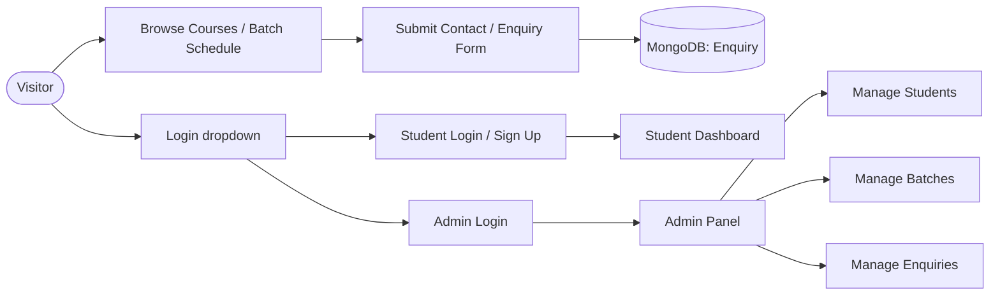
```mermaid
flowchart LR
    A([Visitor]) --> B[Browse Courses / Batch Schedule]
    A --> C[Login dropdown]
    C --> D[Student Login / Sign Up]
    C --> E[Admin Login]
    D --> F[Student Dashboard]
    B --> G[Submit Contact / Enquiry Form]
    G --> H[(MongoDB: Enquiry)]
    E --> I[Admin Panel]
    I --> J[Manage Students]
    I --> K[Manage Batches]
    I --> L[Manage Enquiries]
```

**Auth flow — why passwords never travel or sit in plain text:**

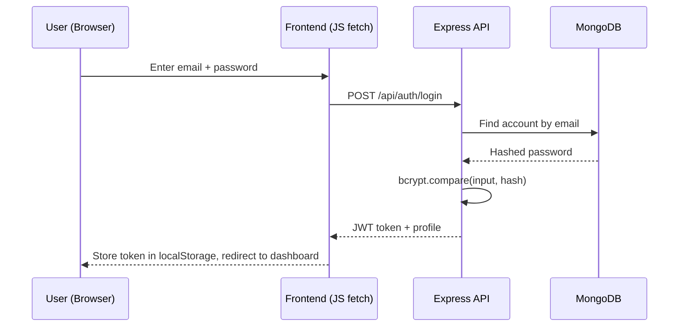
```mermaid
sequenceDiagram
    participant U as User (Browser)
    participant F as Frontend (JS fetch)
    participant A as Express API
    participant DB as MongoDB

    U->>F: Enter email + password
    F->>A: POST /api/auth/login
    A->>DB: Find account by email
    DB-->>A: Hashed password
    A->>A: bcrypt.compare(input, hash)
    A-->>F: JWT token + profile
    F-->>U: Store token in localStorage, redirect to dashboard
```

<div align="right">

[⬆ back to top](#-table-of-contents)

</div>

---

## 🧰 Tech Stack

<div align="center">


</div>

<br/>

<table width="100%">
<tr><th align="left" width="20%">Layer</th><th align="left">Technologies</th></tr>
<tr><td>🎨 <b>Frontend</b></td><td>HTML5, CSS3, vanilla JavaScript, Bootstrap</td></tr>
<tr><td>⚙️ <b>Backend</b></td><td>Node.js, Express.js, JWT (<code>jsonwebtoken</code>), <code>bcryptjs</code>, CORS, dotenv</td></tr>
<tr><td>🗄️ <b>Database</b></td><td>MongoDB + Mongoose <i>(local or MongoDB Atlas free tier)</i></td></tr>
<tr><td>☁️ <b>Deployment</b></td><td>Backend → Render · Frontend → Netlify (or any static host) · Database → MongoDB Atlas</td></tr>
</table>

<div align="right">

[⬆ back to top](#-table-of-contents)

</div>

---

## 📁 Project Structure

```
educlasses/
├── backend/
│   ├── config/db.js          # Mongoose connection
│   ├── models/                # Student, Admin, Batch, Enquiry
│   ├── middleware/auth.js      # requireStudentAuth, requireAdminAuth
│   ├── routes/                 # authRoutes, adminRoutes, batchRoutes, enquiryRoutes
│   ├── seedAdmin.js             # creates/updates the one Admin account
│   ├── seedBatches.js           # optional: seed sample batch data
│   ├── server.js
│   └── .env.example
├── frontend/
│   ├── index.html               # Home
│   ├── Courses.html
│   ├── batch.html                # Batch Schedule
│   ├── Contact.html
│   ├── login.html                # Student Login / Sign Up
│   ├── student.html              # Student Dashboard
│   ├── admin-login.html
│   ├── admin.html                # Admin Dashboard
│   └── assets/
│       ├── images/
│       ├── js/api-config.js       # API_BASE_URL — point this at your backend
│       ├── js/script.js
│       ├── syllabus/               # 9 course syllabus PDFs
│       └── screenshots/            # README preview images
└── README.md
```

<div align="right">

[⬆ back to top](#-table-of-contents)

</div>

---

## 🚀 Getting Started

### ✅ Prerequisites
- **Node.js 18+**
- **MongoDB** running locally, *or* a free [MongoDB Atlas](https://www.mongodb.com/atlas) cluster

### 1️⃣ Clone the repo
```bash
git clone https://github.com/monika0712/educlasses.git
cd educlasses
```

### 2️⃣ Backend setup
```bash
cd backend
npm install
cp .env.example .env
```

Edit `.env` with your own values:
```env
MONGO_URI=mongodb+srv://<username>:<password>@cluster0.mongodb.net/educlasses
JWT_SECRET=change_this_to_a_long_random_secret
PORT=5000
CLIENT_ORIGIN=http://localhost:5500,http://127.0.0.1:5500
ADMIN_NAME=Admin
ADMIN_EMAIL=admin@educlasses.com
ADMIN_PASSWORD=change_this_admin_password
```

**Create the admin account in the database** (run once, or again any time you want to reset the admin password):
```bash
npm run seed:admin
```
You should see:
```
Admin account created for admin@educlasses.com
```

*(Optional)* seed some sample batch schedules:
```bash
npm run seed:batches
```

**Start the server:**
```bash
npm start
```
(or `npm run dev` to auto-restart on file changes)
```
MongoDB connected successfully
EduClasses backend running on port 5000
```

### 3️⃣ Frontend setup

`frontend/assets/js/api-config.js` already points to `http://localhost:5000`, matching the local backend above.

Open `frontend/index.html` with a local server (VS Code **Live Server** extension, or `npx serve frontend` from the project root) — `fetch()` calls work more reliably over http than opening the file directly.

### 4️⃣ Try it out

<table width="100%">
<tr><th align="left">Step</th><th align="left">Where</th></tr>
<tr><td>Register a student</td><td><b>Login</b> dropdown → <b>Student Login</b> → <b>Sign Up</b> tab</td></tr>
<tr><td>View your profile</td><td>Redirects to <code>student.html</code> after sign-up, pulled from MongoDB</td></tr>
<tr><td>Submit an enquiry</td><td><b>Contact</b> page → fill the form → saved as an <code>Enquiry</code></td></tr>
<tr><td>Log in as admin</td><td><b>Login</b> dropdown → <b>Admin Login</b> → use your seeded <code>ADMIN_EMAIL</code> / <code>ADMIN_PASSWORD</code></td></tr>
</table>

<div align="right">

[⬆ back to top](#-table-of-contents)

</div>

---

## 📡 API Reference

### 🔐 Auth (Student)

<table width="100%">
<tr><th align="left" width="10%">Method</th><th align="left" width="30%">Endpoint</th><th align="left" width="20%">Auth</th><th align="left">Description</th></tr>
<tr><td></td><td><code>/api/auth/register</code></td><td>none</td><td>Create a student account</td></tr>
<tr><td></td><td><code>/api/auth/login</code></td><td>none</td><td>Log in, returns JWT</td></tr>
<tr><td></td><td><code>/api/auth/me</code></td><td>student token</td><td>Get logged-in student's profile</td></tr>
</table>

### ✉️ Enquiries & 🗓️ Batches (Public)

<table width="100%">
<tr><th align="left" width="10%">Method</th><th align="left" width="30%">Endpoint</th><th align="left" width="20%">Auth</th><th align="left">Description</th></tr>
<tr><td></td><td><code>/api/enquiry</code></td><td>none</td><td>Submit the contact form</td></tr>
<tr><td></td><td><code>/api/batches</code></td><td>none</td><td>List all batches for the Batch Schedule page</td></tr>
</table>

### 🛡️ Admin

<table width="100%">
<tr><th align="left" width="10%">Method</th><th align="left" width="30%">Endpoint</th><th align="left" width="20%">Auth</th><th align="left">Description</th></tr>
<tr><td></td><td><code>/api/admin/login</code></td><td>none</td><td>Admin login, returns JWT</td></tr>
<tr><td></td><td><code>/api/admin/students</code></td><td>admin token</td><td>List all students</td></tr>
<tr><td></td><td><code>/api/admin/enquiries</code></td><td>admin token</td><td>List all enquiries</td></tr>
<tr><td></td><td><code>/api/admin/enquiries/:id</code></td><td>admin token</td><td>Update an enquiry's status</td></tr>
<tr><td></td><td><code>/api/admin/batches</code></td><td>admin token</td><td>List all batches</td></tr>
<tr><td></td><td><code>/api/admin/batches</code></td><td>admin token</td><td>Add a new batch</td></tr>
<tr><td></td><td><code>/api/admin/batches/:id</code></td><td>admin token</td><td>Update a batch</td></tr>
<tr><td></td><td><code>/api/admin/batches/:id</code></td><td>admin token</td><td>Delete a batch</td></tr>
</table>

<div align="right">

[⬆ back to top](#-table-of-contents)

</div>

---

## 🔍 Checking Your Data

<table width="100%">
<tr><th align="left" width="25%">Option</th><th align="left">How</th></tr>
<tr><td>🖥️ <b>Admin Dashboard</b> <i>(easiest)</i></td><td>Log in at <code>admin-login.html</code> with your seeded credentials — <code>admin.html</code> lists every student, batch, and enquiry live from MongoDB.</td></tr>
<tr><td>🧭 <b>MongoDB Compass</b></td><td>Free desktop GUI — paste your <code>MONGO_URI</code> connection string and browse the <code>students</code>, <code>admins</code>, <code>batches</code>, and <code>enquiries</code> collections directly.</td></tr>
<tr><td>☁️ <b>MongoDB Atlas Web UI</b></td><td>If hosted on Atlas: <a href="https://cloud.mongodb.com">cloud.mongodb.com</a> → your cluster → <b>Browse Collections</b> — same view, no install needed.</td></tr>
</table>

<div align="right">

[⬆ back to top](#-table-of-contents)

</div>

---

## ☁️ Deployment

<table width="100%">
<tr><th align="left" width="20%">Service</th><th align="left" width="20%">Where</th><th align="left">Notes</th></tr>
<tr><td>🎨 <b>Frontend</b></td><td><a href="https://netlify.com">Netlify</a></td><td>Drag-and-drop the <code>frontend/</code> folder, or connect the repo with publish directory <code>frontend</code></td></tr>
<tr><td>⚙️ <b>Backend</b></td><td><a href="https://render.com">Render</a></td><td>Root: <code>backend</code>, build: <code>npm install</code>, start: <code>npm start</code></td></tr>
<tr><td>🗄️ <b>Database</b></td><td><a href="https://www.mongodb.com/cloud/atlas/register">MongoDB Atlas</a></td><td>Free M0 cluster</td></tr>
</table>

**Steps:**
1. Push the repo to GitHub, deploy `backend/` to Render, and add the same environment variables as your local `.env` (set `CLIENT_ORIGIN` to your Netlify URL once you have it).
2. Run `npm run seed:admin` once against the deployed database (via Render's Shell tab, or locally pointed at the same Atlas cluster).
3. In `frontend/assets/js/api-config.js`, update `API_BASE_URL` to your live Render URL.
4. Deploy `frontend/` to Netlify, then update `CLIENT_ORIGIN` on Render to the resulting Netlify URL and redeploy so CORS allows it.

> Free Render web services sleep after inactivity — the first request after idling can take ~30–50 seconds to wake up. That's normal on the free tier.

<div align="right">

[⬆ back to top](#-table-of-contents)

</div>

---

## 🛠 Skills Demonstrated

<table width="100%">
<tr>
<td valign="top" width="33%">

**🎨 Frontend**
- Multi-page static site (HTML/CSS/Bootstrap)
- `fetch()`-based API integration
- Token-based session handling in `localStorage`

</td>
<td valign="top" width="33%">

**⚙️ Backend**
- RESTful API design in Express
- JWT auth & role-based middleware (student vs. admin)
- Mongoose schema design across 4 collections
- Password hashing with bcrypt

</td>
<td valign="top" width="33%">

**🏗️ Engineering**
- Secrets kept out of Git via `.env`
- CORS configured per allowed origin
- Zero-cost deployment pipeline (Render + Netlify + Atlas)

</td>
</tr>
</table>

<div align="right">

[⬆ back to top](#-table-of-contents)

</div>

---

## 🗺️ Roadmap

<table width="100%">
<tr><th align="left" width="70%">Item</th><th align="center">Status</th></tr>
<tr><td>Email verification for student sign-up</td><td align="center"></td></tr>
<tr><td>Course enrollment tracking per student</td><td align="center"></td></tr>
<tr><td>Pagination & search on the admin tables</td><td align="center"></td></tr>
<tr><td>Forgot-password flow for students</td><td align="center"></td></tr>
</table>

<div align="right">

[⬆ back to top](#-table-of-contents)

</div>

---

## 🤝 Contributing

Contributions, issues, and feature requests are welcome!

<table width="100%">
<tr><th align="center" width="10%">Step</th><th align="left">Action</th></tr>
<tr><td align="center">1️⃣</td><td>Fork the project</td></tr>
<tr><td align="center">2️⃣</td><td>Create your feature branch — <code>git checkout -b feature/amazing-feature</code></td></tr>
<tr><td align="center">3️⃣</td><td>Commit your changes — <code>git commit -m 'Add amazing feature'</code></td></tr>
<tr><td align="center">4️⃣</td><td>Push to the branch — <code>git push origin feature/amazing-feature</code></td></tr>
<tr><td align="center">5️⃣</td><td>Open a Pull Request</td></tr>
</table>

<div align="right">

[⬆ back to top](#-table-of-contents)

</div>

---

## 📬 Contact

<div align="center">

**Monika Patil**

[](mailto:patilmonika931@gmail.com)
[](https://github.com/monika0712)

### ⭐ If this project helped you, consider giving it a star — it really helps!


</div>
