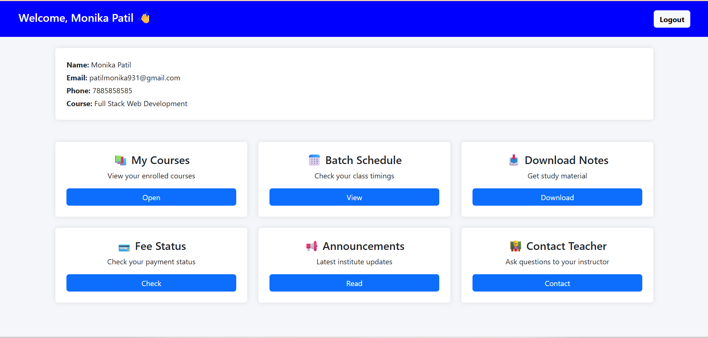

# EduClasses — Full Stack Project

Your site is a full-stack project:

- **frontend/** — the original HTML/CSS/JS pages (home, courses, batch, contact, login, student dashboard) plus an admin panel, connected to a live backend.
- **backend/** — a Node.js + Express + MongoDB API that provides real student accounts, contact-form storage, and a real admin account.

## What changed

| Feature | Before | Now |
|---|---|---|
| Student login | Hardcoded `student` / `1234` in JS | Real accounts stored in MongoDB, passwords hashed with bcrypt, JWT sessions |
| Student signup | Didn't exist | "Sign Up" tab on `login.html` |
| Contact form | Just showed a fake "thank you" message | Real POST to backend, saved in MongoDB as an enquiry |
| Admin | Didn't exist | `admin-login.html` + `admin.html` to view all students & enquiries, backed by a real `Admin` account in MongoDB |
| Admin access | N/A | "Login" button in the navbar is now a dropdown: **Student Login** / **Admin Login** |

Nothing about the visual design was changed — same pages, same styling, same images. Only the logic underneath is real.

---

## 1. Run the backend

```bash
cd backend
npm install
cp .env.example .env
```

Edit `.env` and fill in:
- `MONGO_URI` — get a free cluster at [mongodb.com/atlas](https://www.mongodb.com/atlas) (Free Shared tier is enough), then paste the connection string here.
- `JWT_SECRET` — any long random string.
- `CLIENT_ORIGIN` — leave the local defaults for now (`http://localhost:5500,http://127.0.0.1:5500`).
- `ADMIN_NAME`, `ADMIN_EMAIL`, `ADMIN_PASSWORD` — the admin account you want created. These are only read by the seed command below, not at login time.

**Create the admin account in the database** (run this once, or again any time you want to reset the admin password):

```bash
npm run seed:admin
```

You should see:
```
Admin account created for admin@educlasses.com
```

**Start the server:**

```bash
npm start
```
(or `npm run dev` if you want it to auto-restart on file changes)

You should see:
```
MongoDB connected successfully
EduClasses backend running on port 5000
```

## 2. Run the frontend

`frontend/assets/js/api-config.js` already points to `http://localhost:5000`, which matches the local backend above — no changes needed for local testing.

Open `frontend/index.html` with a local server (VS Code "Live Server" extension, or run `npx serve frontend` from the project root) — don't just double-click the file, `fetch()` calls work better served over http.

Then, in the browser:
- Click **Login** in the navbar → choose **Student Login** or **Admin Login** from the dropdown.
- **Student Login** page → **Sign Up** tab → create a student account → you'll land on `student.html` with your profile pulled from the database.
- **Contact** page → submit the enquiry form → it's saved in MongoDB.
- **Admin Login** page → log in with the `ADMIN_EMAIL` / `ADMIN_PASSWORD` you seeded above → lands on `admin.html`, showing every registered student and every enquiry.

---

## 3. How to check your data

You have two easy ways to see what's actually stored in the database:

### Option A — the Admin Dashboard (easiest, no extra tools)
Log in at `admin-login.html` with your seeded admin credentials. `admin.html` lists every student that signed up and every contact-form enquiry, pulled live from MongoDB. This covers the two collections you'll care about day-to-day (`Student`, `Enquiry`).

### Option B — MongoDB Compass (see every collection, including `Admin`)
Compass is a free desktop GUI for browsing MongoDB directly.
1. Download it from [mongodb.com/products/compass](https://www.mongodb.com/products/compass).
2. Open Compass → paste the same connection string you used for `MONGO_URI` in `.env` → **Connect**.
3. Open your database (named in the connection string, e.g. `educlasses`) → you'll see three collections:
   - `students` — every registered student, with hashed passwords
   - `enquiries` — every contact-form submission
   - `admins` — the one admin account created by `npm run seed:admin`
4. Click any collection to view, filter, edit, or delete individual documents.

### Option C — MongoDB Atlas web UI
If your cluster is on Atlas, you can also browse data without installing anything: log into [cloud.mongodb.com](https://cloud.mongodb.com) → your cluster → **Browse Collections**. Same view as Compass, just in the browser.

---

## 4. Deploy backend to Render

1. Push the `backend/` folder to a GitHub repo (or the whole project — Render lets you set a root directory).
2. On [render.com](https://render.com) → **New → Web Service** → connect your repo.
3. Settings:
   - **Root Directory:** `backend`
   - **Build Command:** `npm install`
   - **Start Command:** `npm start`
4. Add environment variables (same as your local `.env`): `MONGO_URI`, `JWT_SECRET`, `CLIENT_ORIGIN` (set this to your Netlify URL once you have it, e.g. `https://educlasses.netlify.app`).
5. Deploy. Render will give you a live URL like `https://educlasses-backend.onrender.com`.
6. Run the admin seed once against this environment too — either add `ADMIN_NAME`/`ADMIN_EMAIL`/`ADMIN_PASSWORD` as Render env vars and use Render's Shell tab to run `npm run seed:admin`, or run it locally with `MONGO_URI` in your local `.env` pointed at the same Atlas cluster (same effect, since it's the same database).

> Free Render web services sleep after inactivity — the first request after idling can take ~30–50 seconds to wake up. That's normal on the free tier.

## 5. Deploy frontend to Netlify

1. In `frontend/assets/js/api-config.js`, change:
   ```js
   const API_BASE_URL = "https://educlasses-backend.onrender.com";
   ```
   (use your actual Render URL from step 4).
2. On [netlify.com](https://netlify.com) → **Add new site → Deploy manually** → drag and drop the `frontend/` folder (or connect the repo and set **Publish directory** to `frontend`).
3. Netlify gives you a live URL like `https://educlasses.netlify.app`.
4. Go back to Render → update `CLIENT_ORIGIN` to that exact Netlify URL → redeploy the backend so CORS allows it.

Your site is now live end-to-end: real signup/login, real contact form storage, and a real admin dashboard, all backed by MongoDB.

---

## 6. Adding screenshots to this README

A folder is already set up at `frontend/assets/screenshots/` for this. To add a screenshot:

1. Take your screenshot (e.g. of `index.html`, the admin dashboard, or MongoDB Compass showing your data) and save it as a `.png` or `.jpg`.
2. Drop the image file into `frontend/assets/screenshots/` — for example `frontend/assets/screenshots/homepage.png`.
3. In this `README.md`, add a line using Markdown image syntax, pointing at that path:
   ```md
   
   ```
   The text in `[...]` is just the alt text (shown if the image fails to load); the path in `(...)` is where the file actually lives.
4. Save the README — on GitHub, GitLab, or any Markdown viewer, the image will render inline automatically. No extra tooling needed.

Example section you can paste in and fill with your own screenshots:

```md
## Screenshots

### Homepage


### Student Dashboard


### Admin Dashboard

```

---

## API reference

| Method | Endpoint | Auth | Purpose |
|---|---|---|---|
| POST | `/api/auth/register` | none | Create a student account |
| POST | `/api/auth/login` | none | Log in, returns JWT |
| GET | `/api/auth/me` | student token | Get logged-in student's profile |
| POST | `/api/enquiry` | none | Submit contact form |
| POST | `/api/admin/login` | none | Admin login, returns JWT |
| GET | `/api/admin/students` | admin token | List all students |
| GET | `/api/admin/enquiries` | admin token | List all enquiries |
| PATCH | `/api/admin/enquiries/:id` | admin token | Update enquiry status |

## Notes

- Passwords are hashed with bcrypt for both students and the admin — never stored in plain text.
- Sessions use JWT stored in the browser's `localStorage` (`eduToken` for students, `eduAdminToken` for admin).
- The admin account lives in the `admins` collection in MongoDB, created/updated via `npm run seed:admin`. Run that command again any time you want to change the admin's name, email, or password — it updates the existing record instead of creating a duplicate.
